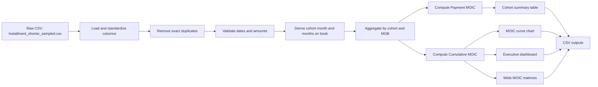
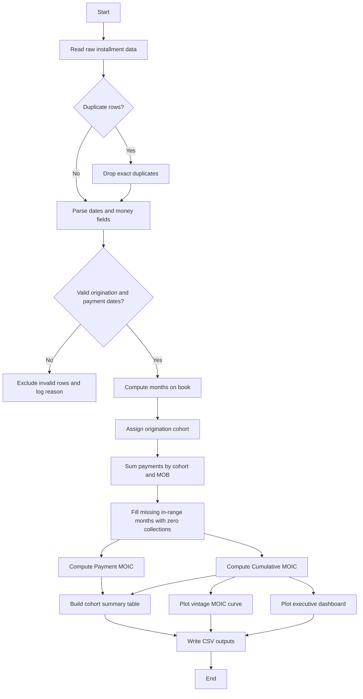
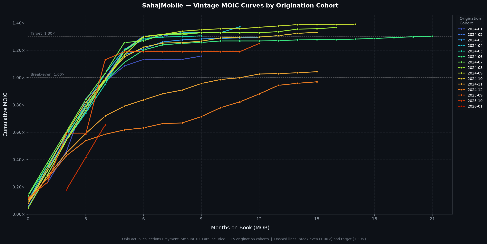
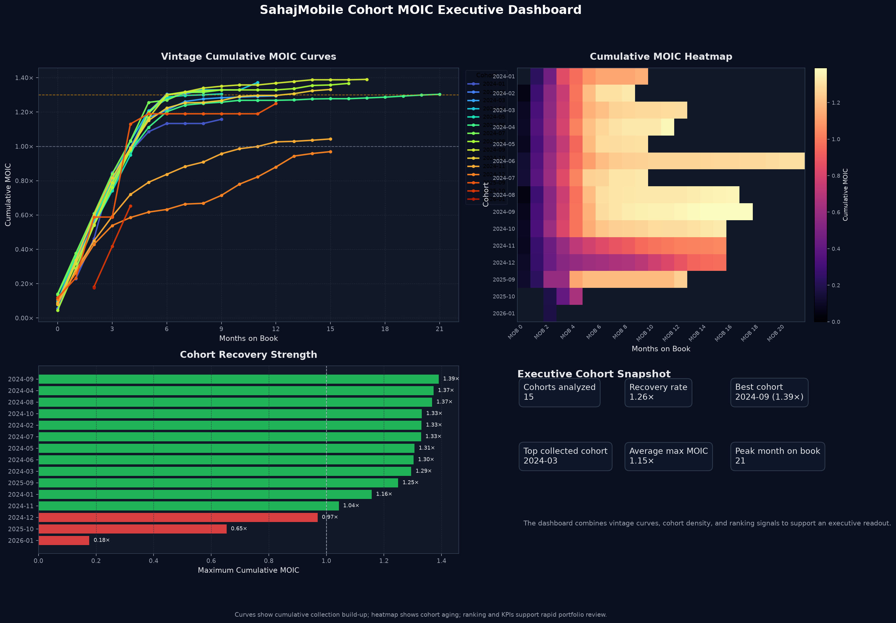

# SahajMobile Cohort MOIC Analysis

## Data Science - Python Project

Data Set download file: [Google Drive link](https://drive.google.com/file/d/1faPRfsnS8OMNu6c4BUjSY4cJV7axmPDs/view?usp=drive_link)

Contact: jason@sahajmobile.com

Python project for building a cohort-based MOIC curve from installment payment data.

## What this project does

The pipeline follows the assignment requirements:

- Treat each `Asset ID` as one financed loan.
- Group loans by origination month.
- Aggregate payments by cohort and months on book.
- Compute Payment MOIC and Cumulative MOIC.
- Plot one vintage curve per origination cohort using Cumulative MOIC.
- Save the cleaned dataset, cohort summary, MOIC tables, and executive visuals.

## Project Architecture



## Processing Flow



## Repository Layout

- `sahajmobile_moic.py` - main script that runs the cohort analysis and writes outputs.
- `sahajmobile_moic.ipynb` - notebook version of the same workflow.
- `Installment_shorter_sampled.csv` - sample dataset provided with the project.
- `outputs/` - generated CSV files and chart images.
- `.github/workflows/ci.yml` - GitHub Actions workflow.
- `docker-compose.yml` - one-command container run.
- `Dockerfile` - container image for the script.
- `requirements.txt` - pinned Python dependencies.
- `README.md` - submission overview and architecture.

## Requirements

- Python 3.14+
- pandas
- numpy
- matplotlib
- pypdf, if you want to read the assignment PDF locally
- Jupyter, if you want to run the notebook

Install locally with:

```bash
python -m venv .venv
source .venv/bin/activate
pip install -r requirements.txt
```

## Run Locally

Run the script from the project folder:

```bash
python sahajmobile_moic.py
```

Optional arguments:

```bash
python sahajmobile_moic.py path/to/input.csv path/to/output-dir
```

The script also supports these environment variables:

- `SAHAJMOBILE_INPUT` - input CSV path
- `SAHAJMOBILE_OUTPUT` - output directory
- `MPLCONFIGDIR` - optional matplotlib cache directory

## Docker Compose

Build and run the analysis container:

```bash
docker compose up --build
```

The container uses the repository mount as its working directory, so generated files appear in `outputs/` on the host.

## Outputs

The pipeline writes these deliverables:

- [cleaned_installments.csv](outputs/cleaned_installments.csv)
- [excluded_rows.csv](outputs/excluded_rows.csv)
- [moic_table.csv](outputs/moic_table.csv)
- [cohort_summary.csv](outputs/cohort_summary.csv)
- [executive_insights.csv](outputs/executive_insights.csv)
- [portfolio_summary.csv](outputs/portfolio_summary.csv)
- [cumulative_moic_matrix.csv](outputs/cumulative_moic_matrix.csv)
- [payment_moic_matrix.csv](outputs/payment_moic_matrix.csv)
- [moic_curve.png](outputs/moic_curve.png)
- [moic_dashboard.png](outputs/moic_dashboard.png)

These files are regenerated from the latest run and kept in the repository as sample deliverables for GitHub review.

## Visual Outputs

The main visuals are embedded below so the GitHub README shows the actual analysis output, not just links.

### Vintage MOIC Curve



### Executive Dashboard



## Sample Outputs

All preview tables below are sourced from the generated files in [outputs/](outputs) and match the latest run of [sahajmobile_moic.py](sahajmobile_moic.py).

### Cleaned Dataset Preview

Source file: [cleaned_installments.csv](outputs/cleaned_installments.csv)

| Asset_ID | Origination_Date | Total_Advance | Total_EMI | Payment_Date | Payment_Amount | Months_on_Book | Cohort |
| --- | --- | --- | --- | --- | --- | --- | --- |
| 264 | 2024-01-31 | 17160.0 | 20540.0 | 2024-02-07 | 860.0 | 1 | 2024-01 |
| 264 | 2024-01-31 | 17160.0 | 20540.0 | 2024-02-14 | 860.0 | 1 | 2024-01 |
| 264 | 2024-01-31 | 17160.0 | 20540.0 | 2024-02-21 | 860.0 | 1 | 2024-01 |
| 264 | 2024-01-31 | 17160.0 | 20540.0 | 2024-02-28 | 860.0 | 1 | 2024-01 |
| 264 | 2024-01-31 | 17160.0 | 20540.0 | 2024-03-06 | 860.0 | 2 | 2024-01 |
| 264 | 2024-01-31 | 17160.0 | 20540.0 | 2024-03-13 | 860.0 | 2 | 2024-01 |
| 264 | 2024-01-31 | 17160.0 | 20540.0 | 2024-03-20 | 860.0 | 2 | 2024-01 |
| 264 | 2024-01-31 | 17160.0 | 20540.0 | 2024-03-27 | 860.0 | 2 | 2024-01 |
| 264 | 2024-01-31 | 17160.0 | 20540.0 | 2024-04-03 | 860.0 | 3 | 2024-01 |
| 264 | 2024-01-31 | 17160.0 | 20540.0 | 2024-04-10 | 9000.0 | 3 | 2024-01 |

### Excluded Rows Preview

Source file: [excluded_rows.csv](outputs/excluded_rows.csv)

| Asset_ID | Origination_Date | Total_Advance | Total_EMI | Payment_Date | Payment_Amount | Exclusion_Reason |
| --- | --- | --- | --- | --- | --- | --- |
| 24105 | 2026-01-06 | 16499.0 | 24359.0 | 1970-01-01 | 2500.0 | Sentinel / Epoch Payment_Date (1970-01-01) |
| 1454 | 2024-11-18 | 10200.0 | 14190.0 | 1970-01-03 | 1.0 | Payment_Date before Origination_Date |
| 1465 | 2024-11-20 | 8375.0 | 14625.0 | 2024-07-02 | 0.0 | Payment_Date before Origination_Date |
| 13747 | 2025-10-24 | 8249.0 | 11600.0 | 2027-11-27 | 2000.0 | Months on Book > 24 — likely data entry error |

### Cohort Summary Preview

Source file: [cohort_summary.csv](outputs/cohort_summary.csv)

| Cohort | Asset_Count | Cohort_Total_Advance | Total_Collected | Max_Months_on_Book | Max_Cumulative_MOIC | Avg_Payment_MOIC |
| --- | --- | --- | --- | --- | --- | --- |
| 2024-01 | 6 | 102945.0 | 119150.0 | 9 | 1.1574141531885958 | 0.1286015725765106 |
| 2024-02 | 11 | 136095.0 | 181074.0 | 8 | 1.3304970792461148 | 0.1478330088051238 |
| 2024-03 | 64 | 795665.0 | 1030222.0 | 12 | 1.2947936631622603 | 0.0995995125509431 |
| 2024-04 | 32 | 368935.0 | 506270.0 | 11 | 1.3722471438058197 | 0.1143539286504849 |
| 2024-05 | 16 | 224805.0 | 293500.0 | 9 | 1.3055759435955605 | 0.130557594359556 |
| 2024-06 | 32 | 447855.0 | 583578.0 | 21 | 1.3030512107713434 | 0.0592296004896065 |
| 2024-07 | 20 | 286900.0 | 381188.0 | 9 | 1.328644126873475 | 0.1328644126873475 |
| 2024-08 | 28 | 325990.0 | 445617.0 | 16 | 1.3669652443326483 | 0.0804097202548616 |
| 2024-09 | 37 | 408306.0 | 567657.0 | 17 | 1.390273471367063 | 0.0772374150759479 |
| 2024-10 | 37 | 461204.0 | 614090.0 | 15 | 1.3314932220882734 | 0.083218326380517 |

### Executive Insights Preview

Source file: [executive_insights.csv](outputs/executive_insights.csv)

| Cohort | Recovery_Status | Seasoned_12M | Latest_MOB | Latest_Cumulative_MOIC | Months_to_Breakeven | Months_to_Target_1_3x | Collection_Share_Pct | Advance_Share_Pct | Max_Cumulative_MOIC |
| --- | --- | --- | --- | --- | --- | --- | --- | --- | --- |
| 2024-09 | Beyond target | True | 17 | 1.390273471367063 | 5 | 7 | 10.02 | 9.08 | 1.390273471367063 |
| 2024-04 | Beyond target | False | 11 | 1.3722471438058195 | 4 | 7 | 8.94 | 8.21 | 1.3722471438058195 |
| 2024-08 | Beyond target | True | 16 | 1.3669652443326483 | 5 | 6 | 7.87 | 7.25 | 1.3669652443326483 |
| 2024-10 | Beyond target | True | 15 | 1.3314932220882734 | 5 | 13 | 10.84 | 10.26 | 1.3314932220882734 |
| 2024-02 | Beyond target | False | 8 | 1.3304970792461148 | 5 | 6 | 3.20 | 3.03 | 1.3304970792461148 |

### MOIC Table Preview

Source file: [moic_table.csv](outputs/moic_table.csv)

| Cohort | Months_on_Book | Period_Collections | Cohort_Total_Advance | Payment_MOIC | Cumulative_Collections | Cumulative_MOIC |
| --- | --- | --- | --- | --- | --- | --- |
| 2024-01 | 1 | 23498.0 | 102945.0 | 0.2282578075671475 | 23498.0 | 0.2282578075671475 |
| 2024-01 | 2 | 24097.0 | 102945.0 | 0.2340764485890524 | 47595.0 | 0.4623342561561999 |
| 2024-01 | 3 | 39580.0 | 102945.0 | 0.384477147991646 | 87175.0 | 0.846811404147846 |
| 2024-01 | 4 | 12689.0 | 102945.0 | 0.1232599932002525 | 99864.0 | 0.9700713973480986 |
| 2024-01 | 5 | 11843.0 | 102945.0 | 0.1150420127252416 | 111707.0 | 1.0851134100733402 |
| 2024-01 | 6 | 4950.0 | 102945.0 | 0.0480839283112341 | 116657.0 | 1.1331973383845744 |
| 2024-01 | 7 | 0.0 | 102945.0 | 0.0 | 116657.0 | 1.1331973383845744 |
| 2024-01 | 8 | 0.0 | 102945.0 | 0.0 | 116657.0 | 1.1331973383845744 |
| 2024-01 | 9 | 2493.0 | 102945.0 | 0.0242168148040215 | 119150.0 | 1.1574141531885958 |
| 2024-02 | 0 | 7520.0 | 136095.0 | 0.0552555200411477 | 7520.0 | 0.0552555200411477 |

### Visual Outputs

- [Vintage MOIC curve](outputs/moic_curve.png)
- [Executive dashboard](outputs/moic_dashboard.png)

### Wide Matrices

The wide cohort matrices are kept in the repository as downloadable CSV files:

- [cumulative_moic_matrix.csv](outputs/cumulative_moic_matrix.csv)
- [payment_moic_matrix.csv](outputs/payment_moic_matrix.csv)

These matrix files are useful for downstream analysis, but the sample preview is intentionally limited because they are wide tables.

### Portfolio Summary

Source file: [portfolio_summary.csv](outputs/portfolio_summary.csv)

| Metric | Value | Unit |
| --- | --- | --- |
| Portfolio Recovery Rate | 1.26 | x |
| Recovered Cohort Share | 95.28 | % of collections |
| Top-3 Cohort Share | 26.83 | % of collections |
| Seasoned Cohorts (12M+) | 8 | cohorts |
| Cohorts Above 1.0x | 12 | cohorts |
| Cohorts Above 1.3x | 8 | cohorts |

## Validation Rules

- Exact duplicate rows are removed before analysis.
- Invalid payment dates are excluded and listed in `excluded_rows.csv`.
- Months on book is calculated from payment date minus origination date.
- Payment MOIC uses collections for one period only.
- Cumulative MOIC uses cumulative collections through each month on book.

## CI/CD

The GitHub Actions workflow runs on push and pull request:

- checks out the repository
- installs Python dependencies
- compiles the Python script
- runs the script on the sample CSV
- validates the analysis finishes successfully
- uploads generated outputs as a workflow artifact

## Notes

The chart uses Cumulative MOIC, which matches the assignment requirement. Payment MOIC is included in the cohort summary and in the wide matrix output for reference.

## Interpretive Analysis

The portfolio is recovering strongly overall, with several cohorts crossing the 1.30× range by mid-to-late months on book. The best-performing cohorts in the sample are 2024-09, 2024-04, 2024-08, and 2024-10, which suggests the underwriting or collection process was especially healthy in that period.

The weaker cohorts are the newer vintages with limited seasoning, especially 2025-10 and 2026-01, where the observed cumulative MOIC is still below 1.0×. That is expected for immature vintages, but it also means their final recovery is not yet fully observable.

The dashboard makes the operational pattern clearer than the table alone: the curve panel shows collection acceleration, the heatmap shows how each vintage fills across months on book, and the ranking panel separates recoverable cohorts from underperforming ones at a glance.

The added executive-insights table turns the project into a more decision-ready artifact by showing when each cohort crosses break-even, when it reaches the 1.30× target, and how much of the portfolio each cohort contributes. That is the kind of compact summary a CTO can scan quickly during a portfolio review.

## CTO Takeaway

If you want this submission to feel stronger to a CTO or senior technical reviewer, the important story is not only the chart; it is the repeatable pipeline behind it.

This project already shows three CTO-relevant strengths:

- It is reproducible: the same analysis runs from raw CSV to outputs through Python, notebook, Docker, and GitHub Actions.
- It is data-aware: duplicates, bad dates, and anomalous records are explicitly handled instead of being silently ignored.
- It is decision-oriented: the dashboard converts row-level installment history into cohort-level recovery signals that can guide portfolio monitoring.

If you want to make it even stronger, the next things a CTO would notice are:

- a short limitations section stating that newer cohorts are not fully seasoned yet,
- a clear assumptions section for months-on-book and exclusion rules,
- and a brief production note about how this could be scheduled daily or weekly as a recurring reporting job.
