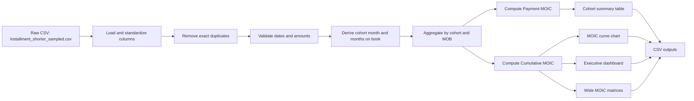
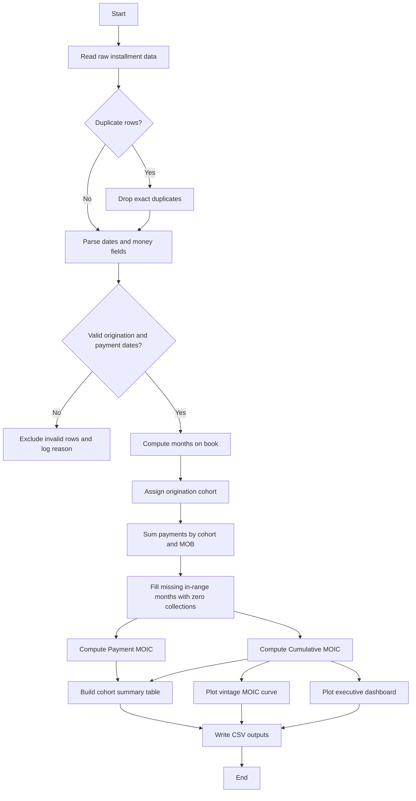

# SahajMobile Cohort MOIC Analysis

Python project for building a cohort-based MOIC curve from installment payment data.

## What this project does

The pipeline follows the assignment requirements:

- Treat each `Asset ID` as one financed loan.
- Group loans by origination month.
- Aggregate payments by cohort and months on book.
- Compute Payment MOIC and Cumulative MOIC.
- Plot one vintage curve per origination cohort using Cumulative MOIC.
- Save the cleaned dataset, cohort summary, MOIC tables, and executive visuals.

## Project Architecture



## Processing Flow



## Repository Layout

- `sahajmobile_moic.py` - main script that runs the cohort analysis and writes outputs.
- `sahajmobile_moic.ipynb` - notebook version of the same workflow.
- `Installment_shorter_sampled.csv` - sample dataset provided with the project.
- `outputs/` - generated CSV files and chart images.
- `.github/workflows/ci.yml` - GitHub Actions workflow.
- `docker-compose.yml` - one-command container run.
- `Dockerfile` - container image for the script.
- `requirements.txt` - pinned Python dependencies.
- `README.md` - submission overview and architecture.

## Requirements

- Python 3.14+
- pandas
- numpy
- matplotlib
- pypdf, if you want to read the assignment PDF locally
- Jupyter, if you want to run the notebook

Install locally with:

```bash
python -m venv .venv
source .venv/bin/activate
pip install -r requirements.txt
```

## Run Locally

Run the script from the project folder:

```bash
python sahajmobile_moic.py
```

Optional arguments:

```bash
python sahajmobile_moic.py path/to/input.csv path/to/output-dir
```

The script also supports these environment variables:

- `SAHAJMOBILE_INPUT` - input CSV path
- `SAHAJMOBILE_OUTPUT` - output directory
- `MPLCONFIGDIR` - optional matplotlib cache directory

## Docker Compose

Build and run the analysis container:

```bash
docker compose up --build
```

The container uses the repository mount as its working directory, so generated files appear in `outputs/` on the host.

## Outputs

The pipeline writes these deliverables:

- `cleaned_installments.csv`
- `excluded_rows.csv`
- `moic_table.csv`
- `cohort_summary.csv`
- `cumulative_moic_matrix.csv`
- `payment_moic_matrix.csv`
- `moic_curve.png`
- `moic_dashboard.png`

## Validation Rules

- Exact duplicate rows are removed before analysis.
- Invalid payment dates are excluded and listed in `excluded_rows.csv`.
- Months on book is calculated from payment date minus origination date.
- Payment MOIC uses collections for one period only.
- Cumulative MOIC uses cumulative collections through each month on book.

## CI/CD

The GitHub Actions workflow runs on push and pull request:

- checks out the repository
- installs Python dependencies
- compiles the Python script
- runs the script on the sample CSV
- validates the analysis finishes successfully
- uploads generated outputs as a workflow artifact

## Notes

The chart uses Cumulative MOIC, which matches the assignment requirement. Payment MOIC is included in the cohort summary and in the wide matrix output for reference.

## Interpretive Analysis

The portfolio is recovering strongly overall, with several cohorts crossing the 1.30× range by mid-to-late months on book. The best-performing cohorts in the sample are 2024-09, 2024-04, 2024-08, and 2024-10, which suggests the underwriting or collection process was especially healthy in that period.

The weaker cohorts are the newer vintages with limited seasoning, especially 2025-10 and 2026-01, where the observed cumulative MOIC is still below 1.0×. That is expected for immature vintages, but it also means their final recovery is not yet fully observable.

The dashboard makes the operational pattern clearer than the table alone: the curve panel shows collection acceleration, the heatmap shows how each vintage fills across months on book, and the ranking panel separates recoverable cohorts from underperforming ones at a glance.
